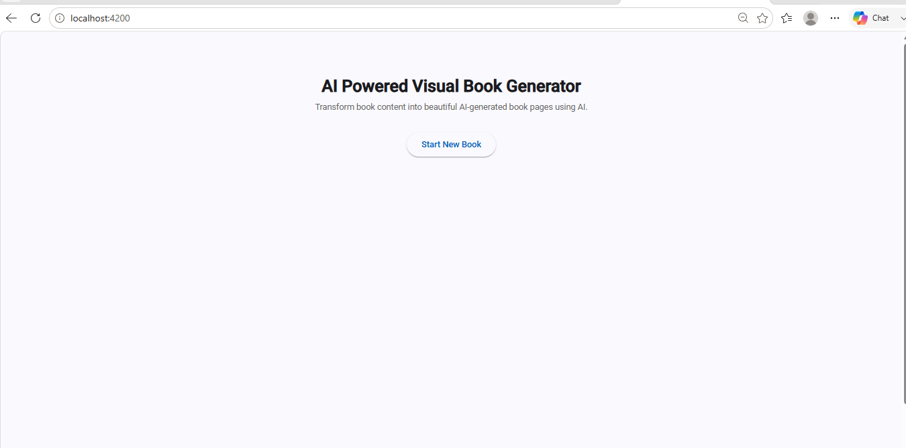
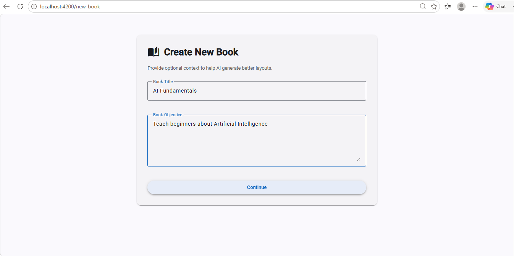
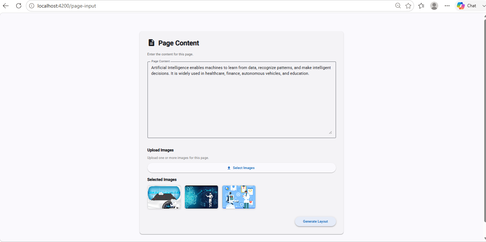
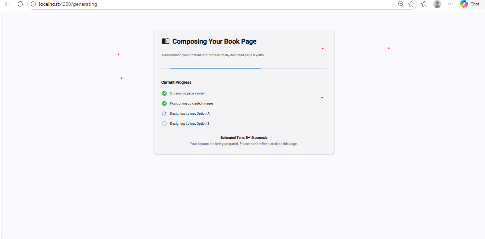
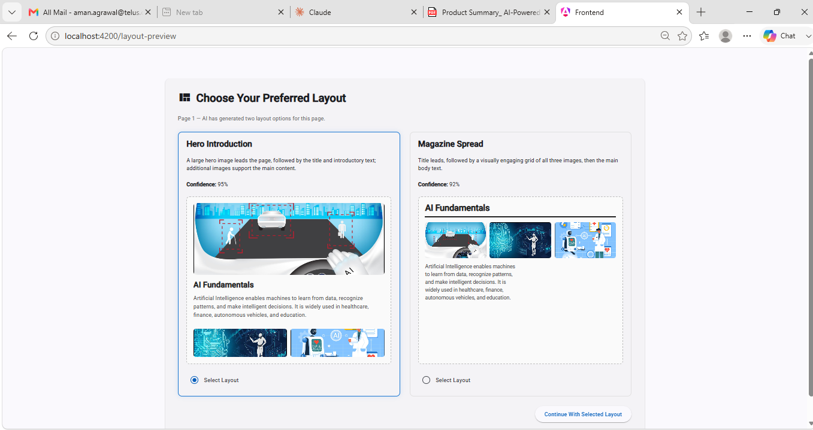
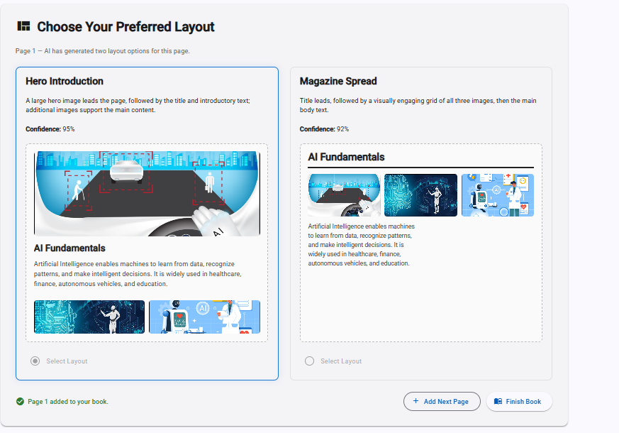
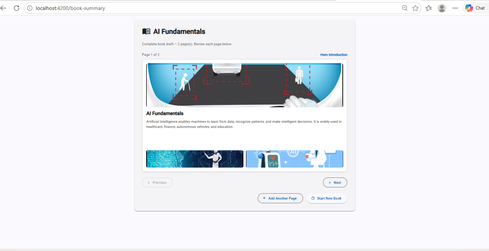
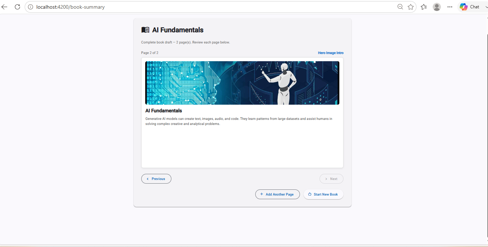

# AI-Powered Visual Book Generator (MVP)

A browser-based tool that turns raw book content (text + images) into a
**visually designed first draft of a book** using an LLM. Built for the EY GenAI
Engineering Assignment.

For each page, the AI recommends **two intelligent layout options**; the user
picks one and moves on, page by page, until a complete book draft is assembled.
The emphasis is on **AI-driven layout intelligence**, not static templates.

---

## What it does

- Create a new book with optional **title** and **objective** (context for the AI).
- Enter page content: **text** + optionally **one or more images**.
- The AI analyzes the content and returns **two distinct layout options**
  (e.g. Hero, Split, Magazine) as **structured JSON**.
- Angular renders both options; the user **selects one**.
- Repeat for each page, then view the **complete book draft** with page
  navigation.

> Core principle: **the LLM decides layout semantics (JSON); Angular owns
> rendering (HTML/CSS).** The model never emits markup.

---

## Tech stack

**Frontend**
- Angular 21.2 (standalone components, **zoneless**, **Signals**)
- Angular Material, SCSS
- TypeScript 5.9, RxJS 7.8
- Unit tests: **Vitest** (Angular 21 default) + `TestBed`

**Backend**
- FastAPI, Python 3.10+
- Pydantic v2 (request/response validation)
- Uvicorn (ASGI server)
- OpenAI Python SDK v2
- Unit/integration tests: **pytest**

**AI**
- OpenAI Chat Completions with `response_format=json_object`
- Prompt engineering with a strict output schema
- Structured JSON output, validated server-side

---

## Architecture at a glance

```
Angular (UI, state, rendering)
        │  HTTP (JSON)
        ▼
FastAPI (validation, prompt orchestration, error mapping)
        │  OpenAI SDK
        ▼
OpenAI  (layout reasoning → structured JSON only)
```

The AI returns a validated JSON contract; Angular maps it to one of several
**layout renderer** strategies. Full details, diagrams, and design decisions:
see [`docs/ARCHITECTURE.md`](docs/ARCHITECTURE.md).

---

## Folder structure

```
ai-powered-visual-book-generator
├── backend
│   ├── app
│   │   ├── api/            # FastAPI routers (health, layout)
│   │   ├── core/           # exceptions
│   │   ├── prompts/        # system + user prompt builders
│   │   ├── schemas/        # Pydantic request/response models
│   │   ├── services/       # OpenAI service (orchestration + error mapping)
│   │   └── main.py         # app + CORS + router registration
│   ├── tests/              # pytest (schemas, prompt, endpoint w/ mocked OpenAI)
│   ├── requirements.txt
│   └── .env.example
├── frontend
│   └── src/app
│       ├── core/services/  # http (ApiService) + state (BookStateService)
│       ├── features/       # home, new-book, page-input, generating,
│       │                   #   layout-preview, book-summary (routed screens)
│       └── shared/
│           ├── components/renderers/  # LayoutRenderer + Hero/Split/Magazine
│           ├── models/                # typed contracts (Book, LayoutOption, …)
│           ├── pipes/                  # ImageRefPipe
│           └── utils/                  # groupSections()
├── docs                    # ARCHITECTURE, API, PROMPTS, ASSUMPTIONS, DEMO, review
└── README.md
```

---

## Getting started

### Prerequisites
- Node.js 20+ and npm 10+
- Python 3.10+
- An OpenAI API key

### 1. Backend

```bash
cd backend
python -m venv .venv
# Windows:
.venv\Scripts\activate
# macOS/Linux:
source .venv/bin/activate

pip install -r requirements.txt

# configure secrets
cp .env.example .env        # Windows: copy .env.example .env
# edit .env and set OPENAI_API_KEY (and optionally OPENAI_MODEL)

uvicorn app.main:app --reload --port 8000
```

Backend runs at `http://localhost:8000` (interactive docs at `/docs`).

### 2. Frontend

```bash
cd frontend
npm install
npm start        # ng serve -> http://localhost:4200
```

CORS is configured to allow the frontend origin `http://localhost:4200`.

---

## Usage flow

1. **Home → Create New Book** — optional title + objective.
2. **Page Content** — enter text, optionally upload images.
3. **Generating** — request goes to FastAPI → OpenAI.
4. **Choose Your Preferred Layout** — pick one of two options.
5. **Add Next Page** or **Finish Book**.
6. **Complete Book Draft** — navigate pages, each rendered with its chosen layout.

---

## Screenshots

End-to-end walkthrough:

**1. Welcome**


**2. Create New Book** (optional title + objective)


**3. Page Content** (text + image upload)


**4. Generating** (content → FastAPI → OpenAI)


**5. Choose Your Preferred Layout** (two distinct AI options)


**6. Layout selected** (page committed to the book)


**7. Complete Book Draft** (with page navigation)


**8. Book draft — next page**


---

## Testing

**Backend** (runnable, no OpenAI calls — the client is mocked):
```bash
cd backend
pytest
```

**Frontend** (Vitest via the Angular CLI):
```bash
cd frontend
npm test
```

What's covered: Pydantic request/response validation, the user-prompt builder,
the `/api/layout/generate` endpoint (happy path + error mapping), and the
frontend deterministic logic (`groupSections`, `ImageRefPipe`, `BookStateService`).
See [`docs/PHASE_8_TESTING_AND_REVIEW.md`](docs/PHASE_8_TESTING_AND_REVIEW.md).

---

## Documentation

| Doc | Contents |
|-----|----------|
| [ARCHITECTURE.md](docs/ARCHITECTURE.md) | System design, diagrams, data/prompt flow, design decisions, trade-offs, scalability |
| [API.md](docs/API.md) | Endpoints, request/response contracts, error codes |
| [PROMPTS.md](docs/PROMPTS.md) | System/user prompt design, output schema, validation |
| [ASSUMPTIONS.md](docs/ASSUMPTIONS.md) | Scoped assumptions & trade-offs (incl. deferred hardening) |
| [PHASE_8_TESTING_AND_REVIEW.md](docs/PHASE_8_TESTING_AND_REVIEW.md) | QA review + production-readiness checklist |
| [DEMO_SCRIPT.md](docs/DEMO_SCRIPT.md) | Demo recording script + presentation flow |

---

## Scope (per the PRD)

**In scope (MVP):** page-by-page text/image input, AI-recommended layouts, two
options per page, user selection, complete on-screen draft.

**Out of scope (PRD Non-Goals):** advanced editing, persistent storage,
themes/style controls, collaboration.

**Future enhancements (PRD §7):** natural-language layout edits, save/revisit,
global style consistency, templates, bulk upload — plus enabling true image
vision (see [ASSUMPTIONS.md](docs/ASSUMPTIONS.md), A1).

---

## License

See `LICENSE`.
