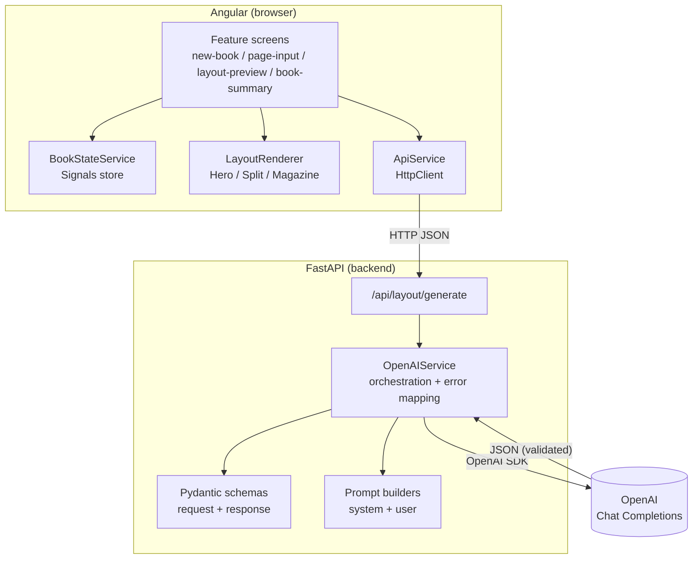
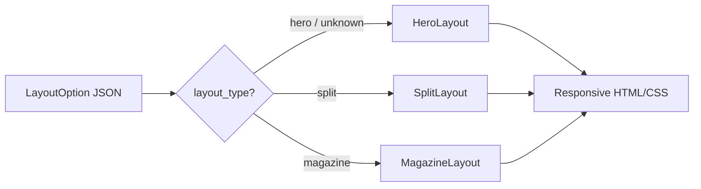

# Architecture

## 1. Guiding principle

**The LLM decides *semantics*; Angular owns *presentation*.**

The model never emits HTML or CSS. It returns a typed JSON description of a page
layout (which archetype, section order, which image goes where). FastAPI
validates that JSON; Angular maps it to a rendering strategy. This single
decision drives most of the design below.

Why this matters:
- **Security** — no model-generated markup ⇒ no HTML/CSS injection (XSS) surface.
- **Determinism & testability** — rendering is a pure function of validated JSON.
- **Cost** — restyling (brand, spacing) never needs another model call.
- **Portability** — the same JSON could later drive PDF/print output.

## 2. High-level components



## 3. Responsibilities (separation of concerns)

| Layer | Owns | Does **not** do |
|-------|------|-----------------|
| **Angular** | UI, user interaction, state, rendering | prompt logic, OpenAI calls |
| **FastAPI** | validation, prompt orchestration, OpenAI comms, error mapping | rendering, UI concerns |
| **OpenAI** | layout reasoning, structured JSON | HTML/CSS, coordinates |

## 4. Request / data flow (per page)

```mermaid
sequenceDiagram
    participant U as User
    participant NG as Angular (page-input)
    participant ST as BookStateService
    participant API as ApiService
    participant BE as FastAPI /generate
    participant AI as OpenAI

    U->>NG: enter text + images, click Generate
    NG->>ST: startDraft(text, images)
    NG->>API: POST /api/layout/generate
    API->>BE: JSON { title, objective, page_text, images }
    BE->>BE: validate request (Pydantic)
    BE->>AI: system + user prompt (json_object)
    AI-->>BE: JSON (2 layout options)
    BE->>BE: validate response (Pydantic)
    BE-->>API: 200 { page_summary, layout_options[] }
    API-->>NG: GenerateLayoutResponse
    NG->>ST: setDraftResponse(response)
    NG->>NG: navigate → layout-preview
    U->>NG: select layout → Continue
    NG->>ST: commitCurrentPage(selectedLayoutId)
    Note over ST: page appended; draft cleared
```

## 5. Rendering: Strategy pattern

`LayoutRenderer` is a dispatcher. It reads `layout_type` from the AI JSON and
picks a presentational component at runtime, with a safe fallback.



- Each strategy is a **dumb/presentational** standalone component with signal
  inputs (`layout`, `images`); it holds no state and calls no service.
- A shared pure `groupSections()` turns the AI's flat, ordered sections into
  roles (title / paragraphs / images); a pure `ImageRefPipe` resolves
  `image_reference` → base64.
- Unknown/malformed `layout_type` degrades gracefully to Hero → the UI never
  breaks on unexpected model output.

**Why Strategy over one big `@if` component?** Open/closed: adding a 4th layout
is a new component + one `@switch` branch, not edits to a growing template. Each
layout stays independently testable.

## 6. State management

`BookStateService` (root-provided, **Signals**-based) is the single source of
truth: book metadata, committed `pages[]`, and the in-progress draft (text,
images, the two options). Screens read read-only signals and mutate only through
intention-revealing methods (`startNewBook`, `startDraft`, `setDraftResponse`,
`commitCurrentPage`, `resetBook`).

**Why Signals over RxJS Subjects?** Synchronous, glitch-free, integrate with
Angular's **zoneless** change detection (this app ships zoneless), and require
no subscribe/unsubscribe (no leak risk). RxJS is still used for the one async
boundary that suits it — the HTTP call in `ApiService`.

## 7. Backend structure

```
app/
├── api/        health.py, layout.py          # thin routers
├── schemas/    request_schema, response_schema # Pydantic contracts
├── prompts/    layout_prompt.py               # SYSTEM_PROMPT + build_user_prompt
├── services/   openai_service.py              # orchestration + typed error mapping
├── core/       exceptions.py                  # HTTP exceptions w/ error_code
└── main.py     app, CORS, router registration
```

The router is intentionally thin; all logic lives in `OpenAIService`. Errors from
OpenAI are mapped to typed HTTP exceptions with stable `error_code`s (see
[API.md](API.md)).

## 8. Design decisions & trade-offs

| Decision | Why | Trade-off / alternative |
|----------|-----|-------------------------|
| LLM returns JSON, not HTML | security, determinism, testability | slightly more mapping code in Angular |
| Strategy-based renderer | open/closed, testable layouts | a few more files vs one component |
| Signals store (not NgRx) | right-sized for MVP, zoneless-friendly | NgRx/Redux would add ceremony not needed here |
| Page-at-a-time model calls | stays within LLM context limits (PRD §8, ~500 pages) | no cross-page style consistency (Future) |
| In-memory state | PRD §6 explicitly "no persistent storage" | refresh loses the book |
| `response_format=json_object` + Pydantic | robust against malformed output | slightly more constrained prompting |

## 9. Scalability & production evolution

- **Concurrency:** the `/generate` endpoint is synchronous (runs in FastAPI's
  threadpool). For higher throughput: `async` route + async OpenAI client.
- **Cost/latency:** add `max_tokens` + timeout; cache identical page inputs;
  downscale images client-side before upload.
- **500-page constraint (PRD §8):** already handled by per-page processing;
  could add summarization/batching for very large books.
- **Persistence:** autosave book state to a datastore + hydrate on load.
- **Observability:** structured logging + request IDs (see deferred hardening in
  [ASSUMPTIONS.md](ASSUMPTIONS.md)).

## 10. Likely CTO questions

1. *Where does the image content reach the model?* Today it does not — only the
   image **count** is sent; image content vision is a documented, scoped
   assumption (ASSUMPTIONS §A1) with a one-line upgrade path.
2. *How do you stop the LLM breaking the UI?* Typed JSON + Pydantic validation +
   escaped Angular interpolation; invalid output fails validation, not the UI.
3. *Why Signals, not NgRx?* Right-sized state for an MVP; zoneless-friendly; no
   boilerplate. NgRx would be over-engineering here.
4. *How does it scale to 500 pages?* Per-page requests bound context; scale path
   is async + caching + persistence.
5. *What's non-deterministic and how do you test it?* Layout quality is the
   model's job; we test the deterministic seams (schema, prompt, mapping, state)
   and mock the model.
